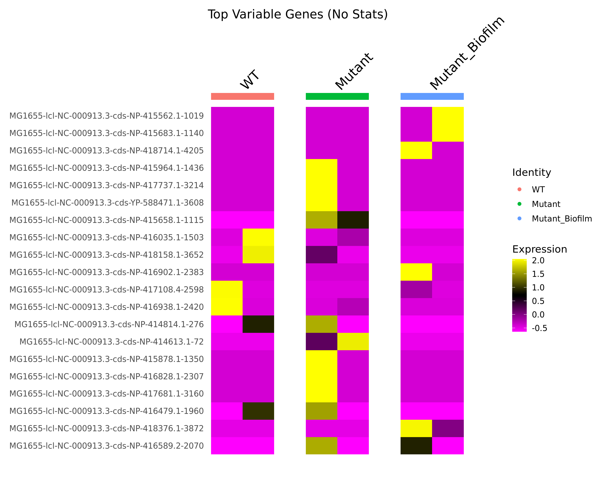

# Microbial Single-Cell Analysis (E. coli Transcriptomics)

## 🦠 Project Overview
This project analyzes RNA-seq data to study gene expression changes in *E. coli* across different conditions: **Wild Type (WT)**, **Mutant**, and **Biofilm**.
We used a Pseudo-bulk approach with **Salmon** for quantification and **Seurat (R)** for analysis.

## 📊 Key Results

### 1. PCA Analysis (Clustering)
The PCA plot shows clear separation between the conditions. Notably, the **Biofilm** samples (Green) are distinctly separated from Planktonic samples, indicating a major transcriptomic shift.

### 2. Gene Expression Heatmap
We identified the top variable genes driving these differences. The heatmap below highlights specific gene clusters activated only during Biofilm formation (bottom yellow block).

## 🛠️ Pipeline
1.  **QC :** FastQC & MultiQC.
2.  **Alignment :** Salmon (Mapping to MG1655 Reference).
3.  **Analysis:** Seurat (Normalization, PCA, Differential Expression).

## 📂 Repository Structure
* `notebooks/`: Jupyter Notebooks containing the code.
* `E_coli_Top_Variable_Genes.csv`: List of identified marker genes.
* `E_coli_Normalized_Counts.csv`: Processed expression matrix.
